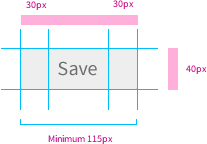

### Description
A button is a basic interaction in which clicking on this element triggers and action. 
Actions might be divided as primary or secondary according to the main purpose of the process. Therefore, there are also primary and secondary buttons in order to properly represent these actions. 

### Behaviour

- Enabled

- Hovered and Focussed

- Pressed

- Disabled

### Proportions

### Style

| Status             | Element                                                  | Details                                 |
| ------------------ |:--------------------------------------------------------:| ---------------------------------------:|
| Enable             |   | Font Awesome: 25px   Colour: #000000 Opacity: 54%  Background: #EEEEEE  Strokeline: #CCCCCC |
| Hovered & Focussed &nbsp;&nbsp;&nbsp;&nbsp; |  | &nbsp;&nbsp;&nbsp;&nbsp; Font Awesome: 25px   Colour: #FFFFFF  Background: #3183BC Strokeline: #CCCCCC	 Dropshadow: Distance 2px Opacity: 12% Softness 1px  Direction 270 |
| Pressed            |  | Font Awesome: 25px   Colour: #FFFFFF  Background: #3183BC   Strokeline: #CCCCCC |
| Disabled            |  | Font Awesome: 25px   Colour: #000000 Opacity: 54%  Background: #FBFBFB Strokeline: #CCCCCC|

### Pattern Usage
A secondary button can be used when there is at least one primary button in the same screen or step. 

There might be several secondary buttons depending on the available actions. 

Whether an action is a primary or secondary one as well as how many buttons might be added needs to be decided according to UX principles. Inform and ask the UX team for each application. 

### Accessibility

### Responsiveness
