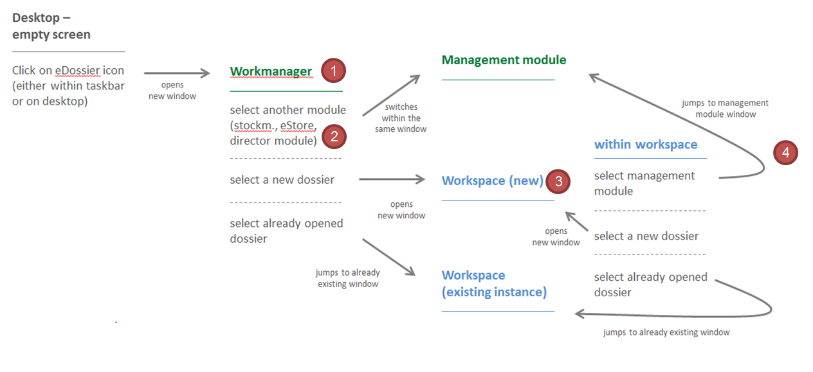

<H1>Application structure</H1>

### Description

The eDossier application is composed of several modules: management modules (workmanager, stockmanager, eStore, etc.) and dossier workspace. 

The management modules are presenting the tasks that each actor of the process has to perform as well as a list of dossiers (in the case of the eStore). The dossier workspace keeps all dossier related information.

### Behaviour

 

### Module Usage

The creation of new modules might be required when a new category of tasks is created. For instance, it is justifyable to create a new module for the classification tasks.

### Accessibility

Keyboard navigation is required to manipulate windows. It should be based on the browsers standard functions.
In addition, extra features will be forseen like the ability to close all open dossiers at once or to list all previously opened dossiers from the global navigation (include link) function.

### Responsiveness

<<<<<<< HEAD
Windows should apply the same level of responsiveness as defined in the browser. Detailed responsiveness attributes should be defined on a case by case basis.
=======
Windows should be responsive...
>>>>>>> 820eb183b9cfa928512ece4d5f866d6dd5bde677
