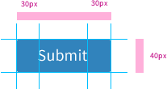

### Description
A button is a basic interaction in which clicking on this element triggers and action. 
Actions might be divided as primary or secondary according to the main purpose of the process. Therefore, there are also primary and secondary buttons in order to properly represent these actions. 

### Behaviour

- Enabled

- Hovered and Focussed

- Pressed

- Disabled

### Proportions

### Style

| Status             | Element                                                  | Details                                 |
| ------------------ |:--------------------------------------------------------:| ---------------------------------------:|
| Enable             |   | Font Awesome: 25px   Colour: #FFFFFF Background: #3183BC Strokeline: #CCCCCC  |
| Hovered & Focused  |  | Font Awesome: 25px   Colour: #FFFFFF Background: #3183BC Strokeline: #CCCCCC Dropshadow: Distance 2px Opacity: 12% Softness 1px  Direction 270 |
| Pressed            |  | Font Awesome: 25px   Colour: #FFFFFF	Background: #2972A5  Strokeline: #CCCCCC  |
| Disabled            |  | Font Awesome: 25px   Colour: #000000 Opacity: 54% Background: #FBFBFB  Strokeline: #CCCCCC |

### Pattern Usage
A primary button is always the first option to place a button. 

There might be several primary buttons if there is also at least a secondary button. 

Whether an action is a primary or secondary one as well as how many buttons might be added needs to be decided according to UX principles. Inform and ask the UX team for each application. 
 

### Accessibility

### Responsiveness
