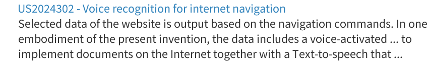

### Description
A link allows navigating between along the application. It is a good practice to show visually a link in order to inform the users they can click on it. 

This pattern includes a particular type of link, the contextual one. It is a word or phrase (known as keyword) within the body of text or list. Clicking on this keyword leads to related content.  

### Behaviour

- Enabled

- Hovered

- Clicked

- Clicked and Visited

- Clicked, Visited and hovered

### Style

| Status                | Element                                                  | Details                                 |
| --------------------- |:--------------------------------------------------------:| ---------------------------------------:|
|Enable                 |  | Source Sans Pro: 20px   Colour: #3183B  |
| Hovered & Focused     |  | Source Sans Pro Underline: 20px   Colour: #3183B |
| Clicked               |  | Source Sans Pro: 20px   Colour: #256A99 |
| Visited               |  | Source Sans Pro: 20px   Colour: #256A99 |
| Visited & Hovered     |  | Source Sans Pro: 20px   Colour: #256A99 |

### Pattern Usage
A link can be used on different cases:
•	Lists of items. Each item leads to extensive related information. E.g.: An article title leads to the full text. 
•	Within a body of text. 
It is a good practice to mark the visited links in order to ease navigation.  

### Accessibility

### Responsiveness
