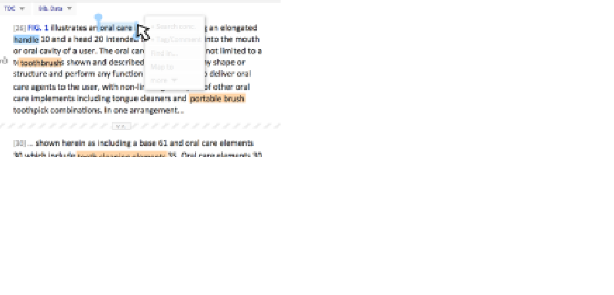

### Description

The on-object menu serves the purpose to directly manipulate content ("on-the-spot").

The basic mechanism starts with a left-click selection by the user within the content, which triggers a semi-transparent menu to appear next to the selection. This menu, if hovered over, allows to select between different options what to do with the selection.

The menu itself is divided into two parts: a main part showing the most probable three to four options of what to do with the selection: and the more part, opening a further list of items to be selected from.

The functions entailed within the menu can vary depening on the task and the specific context in which the on-object menu is called.

### What problem does the pattern solve?

Direct manipulation of content without a lot of mouse movements to toolbars of far-aay options.

### When to use it

On-the-spot modification and annotation of content. Only reasonable if more than one function to modify the content is available.

### How to use it

Menu should be unobtrusive, in the sense of not covering too much main content and not being in the way of the user interaction with content.

### Why use it

Direct Opportunity to manipulate and annotate content.

### See also
[a relative link](../01-atoms/button.md)

