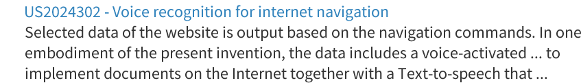
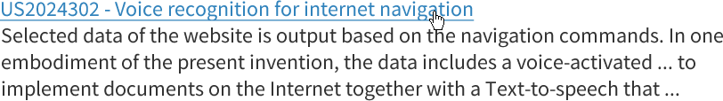
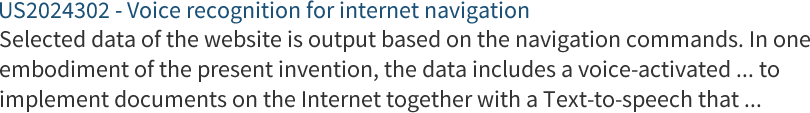
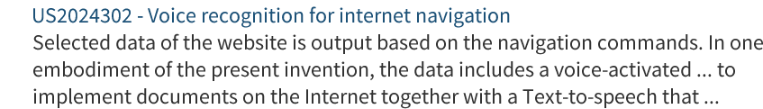
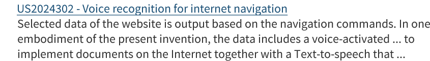

### Description
A link allows navigating between along the application. It is a good practice to show visually a link in order to inform the users they can click on it. 

This pattern includes a particular type of link, the contextual one. It is a word or phrase (known as keyword) within the body of text or list. Clicking on this keyword leads to related content.  

### Behaviour

#### Enabled

 

#### Hovered

 &nbsp;&nbsp;&nbsp;&nbsp;&nbsp;&nbsp;&nbsp;&nbsp;

#### Clicked

 &nbsp;&nbsp;&nbsp;&nbsp;&nbsp;&nbsp;&nbsp;&nbsp;

#### Clicked and Visited

#### Clicked, Visited and Hovered

 

### Style

| Status | Element                                                  | Details                                 |
| :------------------ |:--------------------------------------------------------:| ---------------------------------------:|
| Enable |  | Source Sans Pro: 20px Colour: #3183B | 
| Hovered & Focused&nbsp;&nbsp;&nbsp;&nbsp; |  | &nbsp;&nbsp;&nbsp;&nbsp;Source Sans Pro Underline: 20px Colour: #3183B |
| Clicked |  | Source Sans Pro: 20px Colour: #256A99 |
| Visited |  | Source Sans Pro: 20px Colour: #256A99 |
| Visited & Hovered |  | Source Sans Pro: 20px Colour: #256A99 |

### Pattern Usage
A link can be used on different cases:

-	Lists of items. Each item leads to extensive related information. E.g.: An article title leads to the full text. 
-	Within a body of text. 

It is a good practice to mark the visited links in order to ease navigation.  

### Accessibility

### Responsiveness
