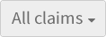
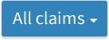
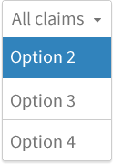
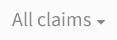
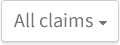

### Description
It is a menu or list that appears below when an option is selected. It remains visible until is used or dismissed.

### Behaviour

#### Enabled

#### Hovered and Focussed

#### Pressed

#### Disabled

### Style

| Status             | Element                                                  | Details                                 |
| :------------------ |:--------------------------------------------------------:| ---------------------------------------:|
| Enable             |   | Font Awesome: 25px   Colour: #000000 Opacity: 54%  Background: #EEEEEE  Strokeline: #CCCCCC |
| Hovered & Focused &nbsp;&nbsp;&nbsp;&nbsp; |  | &nbsp;&nbsp;&nbsp;&nbsp; Font Awesome: 25px   Colour: #FFFFFF  Background: #3183BC Strokeline: #CCCCCC	 Dropshadow: Distance 2px Opacity: 12% Softness 1px  Direction 270 |
| Pressed            |  | Font Awesome: 25px   Colour: #000000 Opacity: 54%  Background: #FFFFFF  Strokeline: #CCCCCC  Dropshadow: Distance 2px Opacity: 12% Softness 1px  Direction 270 |
| Disabled            |  | Font Awesome: 25px   Colour: #000000 Opacity: 54%  Background: #FBFBFB |

### Pattern Usage
When there are several options to choose regarding a single concept. This solution saves space in the layout and gathers gather possible values from a list
Display a list or menu and allow the user choosing one or several values from the list 

### Accessibility

### Responsiveness
